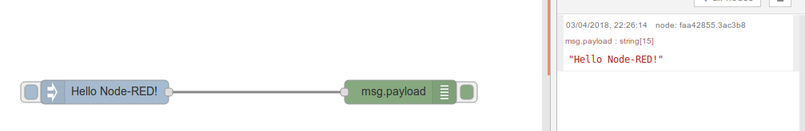
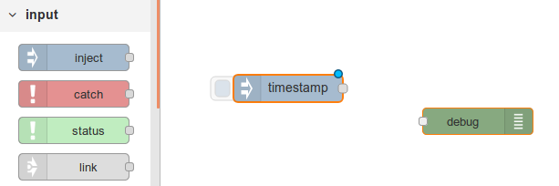
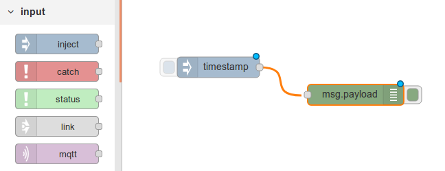
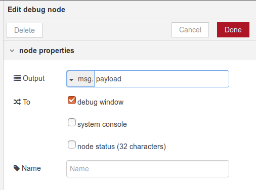
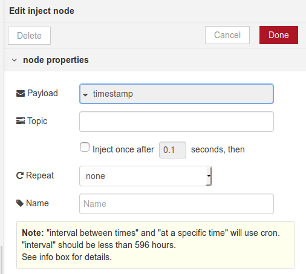

### Lab - basic user response

Step one for any first-time exercise with a new programming tool is `Hello World!`

The most basic option for this in Node-RED a combination of an `Inject` and a `Debug` node; for Node-RED this looks like

This is achieved by click/dragging an Inject node from the palette on the left, onto the canvas:

then do the same for the Debug node:

and link the output of Inject to the input of Debug:

Click-and-hold the output connector of the Inject node, drag the connection line to the Debug node inout connector, ensuring the target connector turns orange; then release.

Review the Debug node by double-clicking in the body of the node, and you will see the configuration panel:

Click `Cancel`.

Review the Inject node by double-clicking in the body of the node, and you will see its configuration panel:

Click on the black triangle next to `timestamp`, select the `string` option, and type into the new text entry field the message you woould like to see in the debug window. Then click `Done`.

You should see that the Inject node has a blue dot, indicating it has been modified:

also observe that the top-right menu now has a red `Deploy` button:

This indicates the Node-RED configuration has changed and does not match the running application. Click `Deploy` to add the flow you just created into Node-RED runtime.

Click on the button on the left side of the `Inject` node and observe the message displayed in the debug window:

*_Congratulations!_* - you have established a working Node-RED live application, and successfully generated data.
