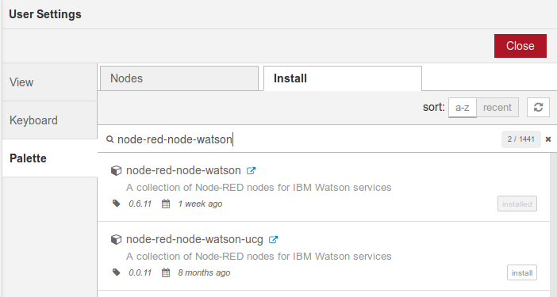

### Lab - Installing the Watson AI nodes

To be able to easily invoke the Watson AI services from Node-RED, we will be using the 
*node-red-node-watson* package (created by Soheel Chughtai @chughs and a growing groupo of maintainers and contributors)

Check down the left side of your Node-RED development environment - you should have something like:

If you don't have the nodes installed, you will need to use the `Manage Palette` option from the Node-RED menu:
, select the `Install` tab, and enter **node-red-node-watson** in the search area.

You should see one (or perhaps two) results:

Click on the `Install` option for **node-red-node-watson** and when the installatoin completes, return to the Node-RED IDE.

Check again for the presence of the Watson nodes:

Now let's get on with the next lab.
