<div style="page-break-after: always;"></div>
### Lab - twitter chatbot setup

Now, a selection of the tweets can be directed to a chatbot service to trigger a response (based on the Watson Assitant service).

Add the following 4-node flow to the existing Twitter analysis flow:

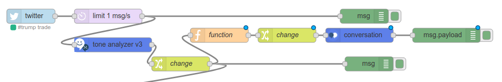

Now, get hold of an existing Chatbot configuration; for this lab, we will be using one of the many Bot definitions at the [IBM Bot Asset Exchange](https://developer.ibm.com/code/exchanges/bots/?s=jay-z). Click this link to access the sample Bot.

Click the `Get this bot` option and save the resulting JSON string to a local file. This file will be imported into the Watson Assistant tool shortly.

This bot responds to queries/inputs with the lyrics and wisdom of renowned artist [Jay-Z](https://en.wikipedia.org/wiki/Jay-Z).

Yo will need to create an instance of the Watson Assistant service in the IBM Cloud catalog -
 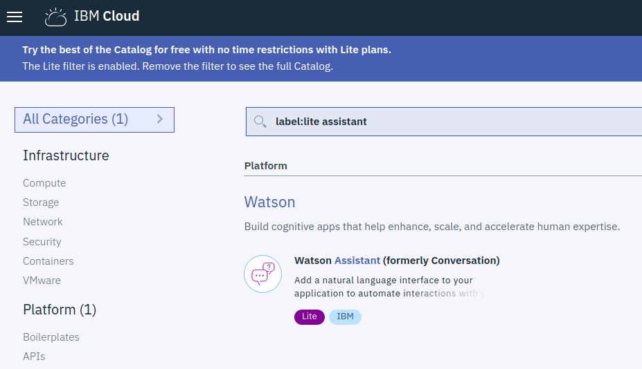

As before when creating services, leave the name to default, create the instance, and when presented with the service overview panels, use the `Launch Tool` option to begin creating a Conversation workspace. The workspace will be populated by importing the earlier JSON file.

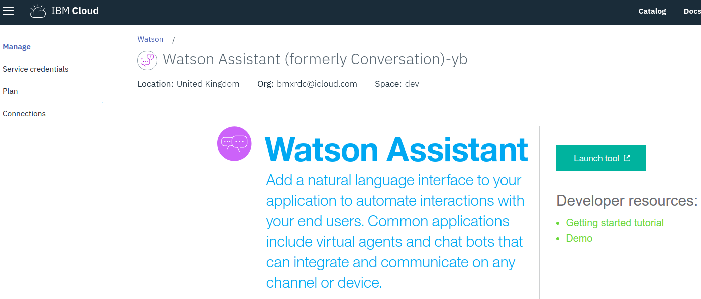

Select the `Create a Workspace` option

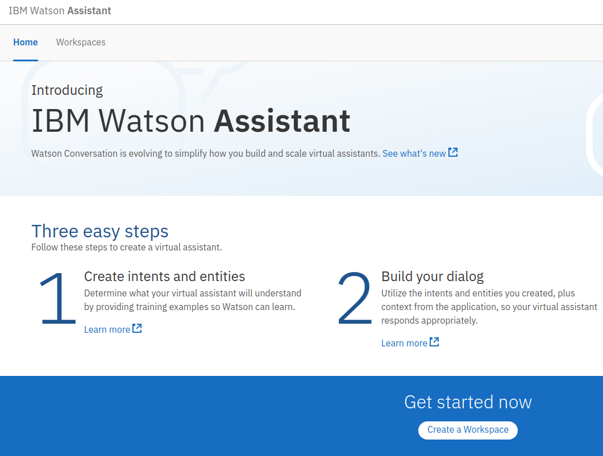

And *_carefully_* **NOT** clicking on the `Create` option, select the `Import workspace` icon   and navigate to your saved Jay-Z bot JSON file.

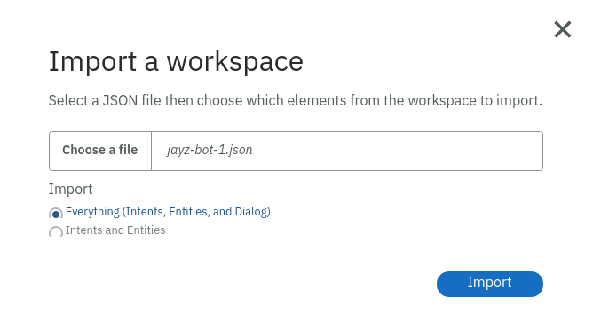

This should result in a new workspace being created, using the definitions in the JSON file

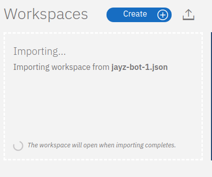

This will create the 3 main areas of chatbot server configuration:
1. Intents:
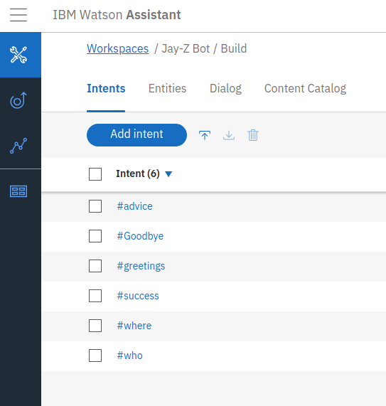
1. Entities:
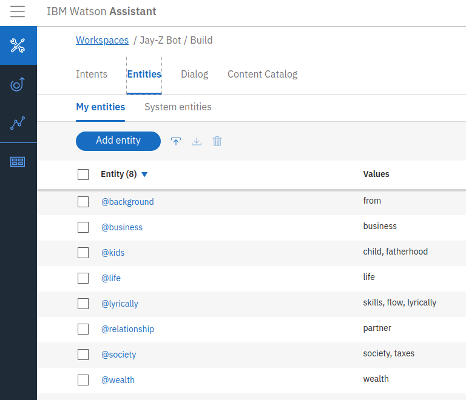
1. Dialog:
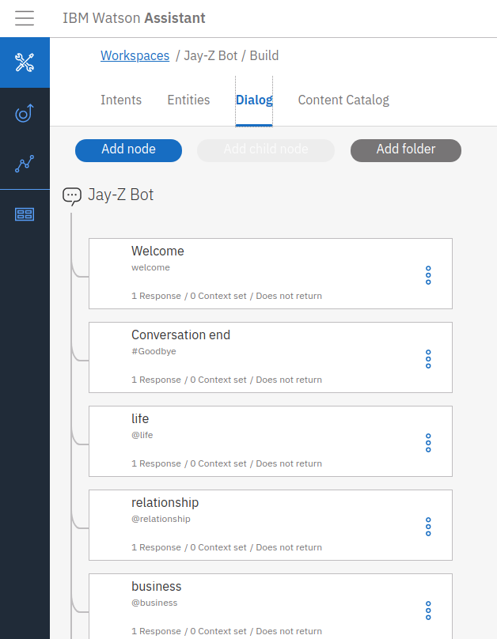


Using the existing Node-RED flow, select messages with a particularly high emotional count in any of the tone category streams from the twitter analysis [Joy, Anger, Disgust, Sadness, Fear], to direct into the Chatbot, using the Watson Conversation node


You will need the credentials for the Watson Assistant instance, to plug into the node configuration menu. Either:
+ make a connection between the Watson Assitant instance, and your Node-Red application, and after re-stage, the credentials will automatically populate the Watson Conversation nodes
+ copy the credentials from the Watson Assitant instance, and apply directly to the node configuration, and use straight away (as you did previously for the Watson Tone Analyzer service)

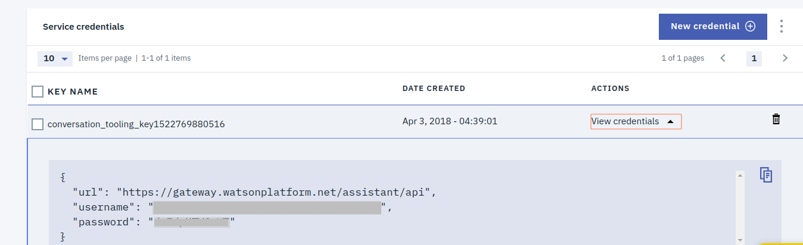

**Note** - you also need the Watson Assistant workspace identifier to plug in to the node configuration

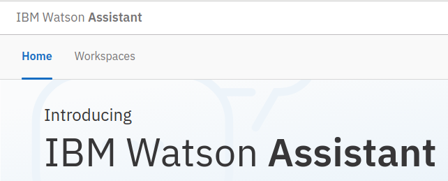

Select the `Workspaces` tab, to access the workspaces in this instance.

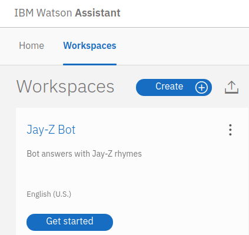

Click the details menu  and select `View details` to view the `Workspace ID` - add this into the corresponding field in the Node-RED Conversation node configuration panel.

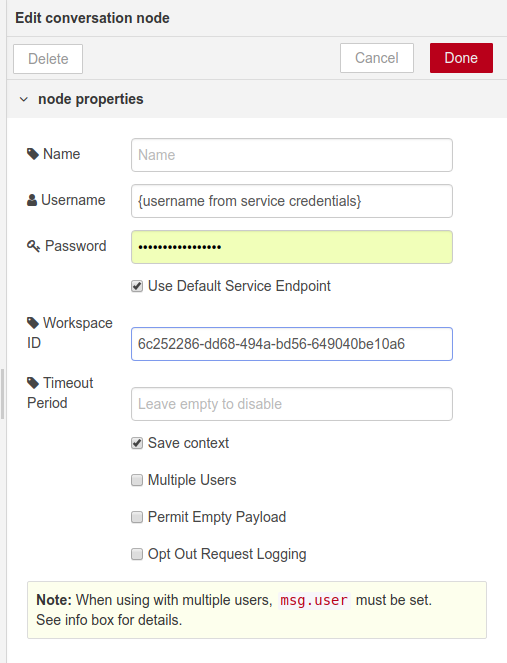

The output from the `conversation` is a JSON object in `msg.payload` - to extract the text and display in the debug pane, update the `debug` node to select just that part of the message:

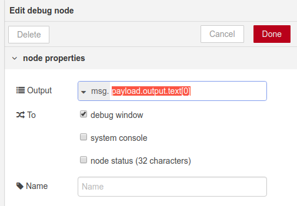

Configure the `change` node to move the twitter content into the `msg.payload` property:

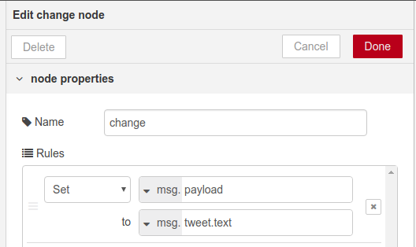

Last, but not least, configure the `function` node to select messages based on high emotional tone:

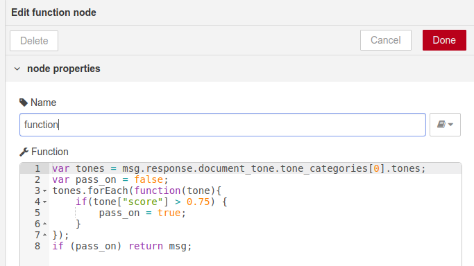
```
var tones = msg.response.document_tone.tone_categories[0].tones;
var pass_on = false;
tones.forEach(function(tone){
    if(tone["score"] > 0.75) {
        pass_on = true;
    }
});
if (pass_on) return msg;
```

And finally  !!

*_Congratulations!_* - you have completed the process of generating responses to select tweets, using a basic chatbot configuration.
