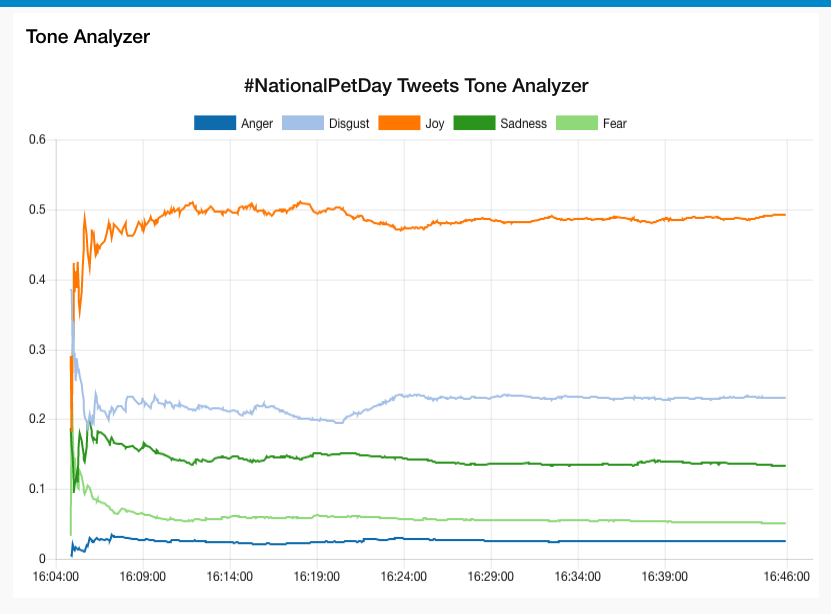
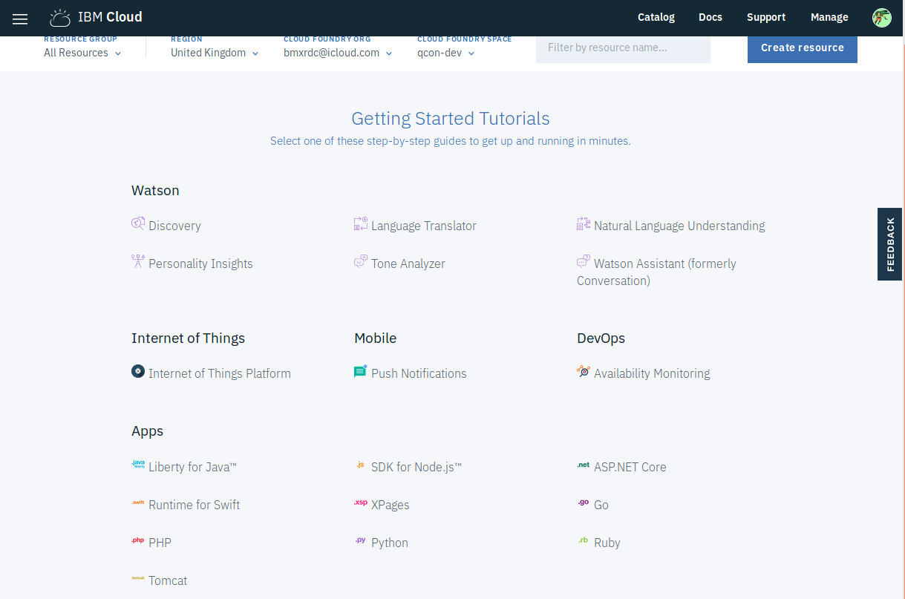
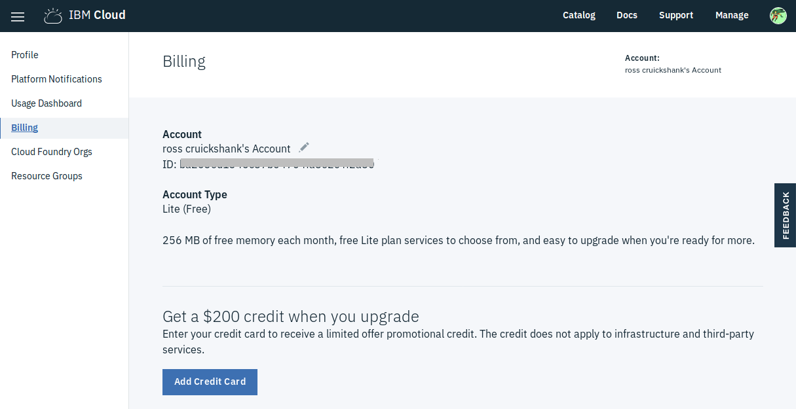
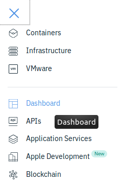
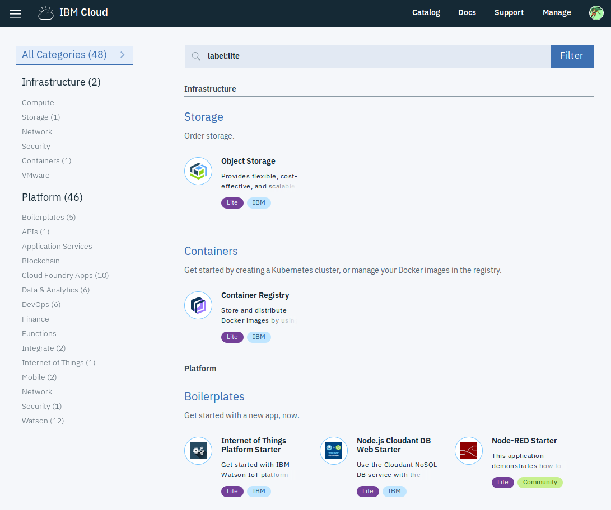
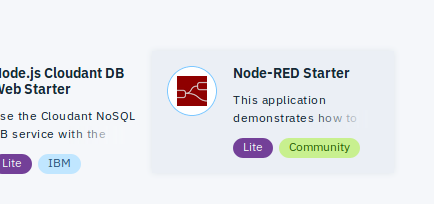
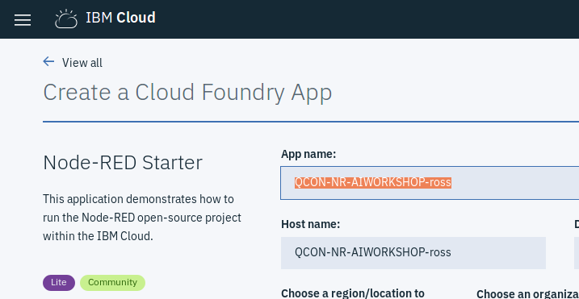

# AI benefits for the lazy hacker

**Use Node-RED lo-code tool to experiment with Cognitive services**

_Ross Cruickshank - Developer Advocate - IBM UK & Ireland_  
_@rcruicks_  
_ross@vnet.ibm.com_

## Get fast usable access to AI services with Node-RED

The purpose of this workshop is to give you quick and easy access to the *IBM Watson Cognitive Services* APIs, and allow you to experiment with
+ Image classification
+ Speech to text, and text to speech
+ Document discovery
+ Language identification and translation
with little or no code.

This workshop assumes a little programming understanding/experience - an appreciation of procedural logic, data structure, and the use of API-based services.

For those with full-on developer experience, we hope you'll find using the [Node-RED](http://nodered.org) tools a fun and useful addition to your skills kitbag.

### What You’ll Learn
We will kick off with the basics of running  in the IBM Cloud (previously known as *Bluemix*).

You'll learn how to construct event flows in the Integrated Development Environment (IDE), through simple, and progressively more complex examples.

Then you'll be ready to link into the Watson services, to experiment with off-the-shelf Articial Intelligence capabilities you can use straight away to build or enhance applications.

Immediate results will be a Node-RED web server app which can display trending emotions associated with a popular Twitter hashtag, and optional generate (in)appropriate responses or replies.

### What You’ll Need

1. A laptop running Windows, MacOS, or linux, with access to the public internet.
1. A current version of one of the following browsers:
  + [Firefox](https://firefox.com)
  + [Chrome](https://chrome.com)
  + [Safari](https://apple.com/safari/)
1. An IBM Cloud account; if you don't have one already, sign up at [IBM Cloud account setup](https://ibm.biz/BdZ2Gz)

For a brand new IBM Cloud account, that's it!

If you have an existing IBM Cloud account, and have existing applications and services, particularly *Cloudant* database instances, you'll possibly need a couple of extra tools:
1. the [Cloud Foundry](https://cloudfoundry.org) command line tool `cf`
  + [download and install `cf` from github](https://github.com/cloudfoundry/cli#downloads).
1. the [Git Version Control Management](https://git-scm.com) command line tool `git`
  + [download and install `git` from git-scm](https://git-scm.com/downloads)

## A note of thanks and appreciation

Sections of this workshop take significant inspiration (and a bit of sample code) from the [Watson Tone Analyzer Tutorial](http://developers.sensetecnic.com/article/tutorial-use-the-watson-cognitive-service-with-fred/) by Michael Qiu from the excellent team at [SenseTecnic](http://developers.sensetecnic.com/).

Sample data sourced via RESTful API calls is provided by [typicode's JSONPlaceHolder](https://jsonplaceholder.typicode.com/)

## Installation/environment Requirements
Using your IBM Cloud account, login to the IBM Cloud [console](https://console.bluemix.net).

For a brand new IBM Cloud account, you'll see a dashboard similar to  this:

We need to establish what type of IBM Cloud you have, so there are a couple of simple steps:
1. at the top right of the dashboard, click on `Manage`
1. click `Billing and Usage`
1. and then click `Billing`

The resulting page 
shows the `Account Type` information.

**Note your account type**

To return to the dashboard view, click on the  menu icon, and click on `Dashboard`

### [Things to know about your IBM Cloud account](overview-ibm-cloud.md)

## Getting started

### Account type = `Lite (Free)`, no existing applications or services

This is the simplest starting point.

From the `Dashboard`, click on `Catalog` at top-right. You should see a page similar to this:

(The categories and numbers vary from time to time, as new offerings are published, and older/less popular services are deprecated).

The area of interest for this workshop is the `Node-RED Starter` Boilerplate, shown here bottom-right.

This boilerplate will create a ready-to-use web-accessible Node-RED application, employing three components:
1. [**Cloudant**](https://en.wikipedia.org/wiki/Cloudant) nosql database - used to store Node-RED configurations (and application-generated data) - see also [Apache CouchDB](https://github.com/apache/couchdb)
1. Node.js runtime container (**node v6.13.0** at time of writing)
1. Node-RED application package (**node-red v0.18.4** at time of writing)

Hover over the description of the Node-Red Starter until hilighted:

then click.

At this point, you will need to provide a **unique** name for your hosted application - note, you only need to enter a name into the `App name:` field; the `Host name:` field will fill automatically.

(if you're stuck for a name - as a minimum, change the example by overwriting "ross" with some random - alphanumeric - characters)

## [Introduction to Watson Services](overview-watson-api.md)

## Labs Overview

In this lab, you will learn how to Node-RED can be used as a rapid protoyping server application which can integrate local and remote data, and present information in a variety of eaisly consumable forms.

The first couple of activities help set up Node-RED as a web application service.
1. Initially, simple application-generated data will be sent to the requester (a browser).
1. Then remote data will be requested, reformatted and returned to the requester.
1. Next, your application will use the Watson Tone Analyzer service referred to earlier to quickly and easily analyze the content of Twitter messages and graphically display the trending tones/sentiments embodied in the messages.
1. Finally, select tweets will be exchanged with an example Watson Conversation Agent (Chatbot) and the responses sent to the requester.

## [LAB: NodeRED live](labs/node-red-basic.md)

## [LAB: NodeRED server](labs/node-red-server.md)

## [LAB: NodeRED remote data](labs/node-red-remote.md)

The next Lab will build on your new Node-RED skills to pull in tweets from [Twitter](https://twitter.com), analyze with the Watson AI language services, and generate a dashboard showing trending emotional response.

## [LAB: Twitter emotional tone](labs/twitter-tone.md)

The next Lab will extend this to direct some of the tweets (those with higher emotional levels - > 0.75, for example) to a chatbot, which will offer responses based on the content of the tweet.

## [LAB: Twitter chatbot](labs/twitter-chatbot.md)

## [LAB: A challenge!](labs/challenge.md)

## Congratulations!

If you got this far, you will have added some news skills, and hopefully gained some pleasure from using the lo-code environment of Node-RED to explore APIs and services.

Capabilities you implemented:

+ Live **Node-RED** application deployed to **IBM Cloud Cloud Foundry** environment
+ application retrieve and reformat data from remote API service (**JSONServer**)
+ application able to respond to requests for data from browsers or other HTTP requests
+ integrate with **Twitter** to receive live tweets on particular topics/areas of interest
+ analyze Tweets for emotional tones using **Watson Tone Analyzer** service
+ display a dashboard widget charting the changes in average emotional tone over time
+ select a subset of messages based on emotional tone levels, and generate comments using **Watson Assistant** language processing and dialog service
