# AI benefits for the lazy hacker

## Get fast usable access to AI services with Node-RED

The purpose of this workshop is to give you quick and easy access to the *IBM Watson Cognitive Services* APIs, and allow you to experiment with
+ Image classification
+ Speech to text, and text to speech
+ Document discovery
+ Language identification and translation
with little or no code.

This workshop assumes a little programming understanding/experience - an appreciation of procedural logic, data structure, and the use of API-based services.

For those with full-on developer experience, we hope you'll find using the [Node-RED](http://nodered.org) tools a fun and useful addition to your skills kitbag.

### What You’ll Learn
We will kick off with the basics of running  in the IBM Cloud (previously known as *Bluemix*).

You'll learn how to construct event flows in the Integrated Development Environment (IDE), through simple, and progressively more complex examples.

Then you'll be ready to link into the Watson services, to experiment with off-the-shelf Articial Intelligence capabilities you can use straight away to build or enhance applications.

Immediate results will be a Node-RED web server app which can display trending emotions associated with a popular Twitter hashtag, and optional generate (in)appropriate responses or replies.


<div style="page-break-after: always;"></div>
### What You’ll Need

1. A laptop running Windows, MacOS, or linux, with access to the public internet.
1. A current version of one of the following browsers:
  + [Firefox](https://firefox.com)
  + [Chrome](https://chrome.com)
  + [Safari](https://apple.com/safari/)
1. An IBM Cloud account; if you don't have one already, sign up at [IBM Cloud account setup](https://ibm.biz/BdZ2Gz)

For a brand new IBM Cloud account, that's it!

If you have an existing IBM Cloud account, and have existing applications and services, particularly *Cloudant* database instances, you'll possibly need a couple of extra tools:
1. the [Cloud Foundry](https://cloudfoundry.org) command line tool `cf`
  + [download and install `cf` from github](https://github.com/cloudfoundry/cli#downloads).
1. the [Git Version Control Management](https://git-scm.com) command line tool `git`
  + [download and install `git` from git-scm](https://git-scm.com/downloads)

## A note of thanks and appreciation

Sections of this workshop take significant inspiration (and a bit of sample code) from the [Watson Tone Analyzer Tutorial](http://developers.sensetecnic.com/article/tutorial-use-the-watson-cognitive-service-with-fred/) by Michael Qiu from the excellent team at [SenseTecnic](http://developers.sensetecnic.com/).

Sample data sourced via RESTful API calls is provided by [typicode's JSONPlaceHolder](https://jsonplaceholder.typicode.com/)

<div style="page-break-after: always;"></div>
## Installation/environment Requirements
Using your IBM Cloud account, login to the IBM Cloud [console](https://console.bluemix.net).

For a brand new IBM Cloud account, you'll see a dashboard similar to  this:


We need to establish what type of IBM Cloud you have, so there are a couple of simple steps:
1. at the top right of the dashboard, click on `Manage`
1. click `Billing and Usage`
1. and then click `Billing`

The resulting page 
shows the `Account Type` information.

**Note your account type**

To return to the dashboard view, click on the  menu icon, and click on `Dashboard`


<div style="page-break-after: always;"></div>
## Things to know about your account

`Lite (Free)`
+ 256M runtime memory, up to 100 service instances
  * sample applications tend to be created with 256M allocated, so will need adjusted if you want to run more than one application at a time
  * service instances by IBM (database, messaging, Watson, etc) will be created with what is call a *Lite Plan*, only one each of which can defined to your account at any time; for example, trying to create a second Watson Speech to Text service instance will fail
  * third party services which have no IBM Cloud charging plan (twilio, elephantSQL, rediscloud, ...) can be added, subject to the provider's restrictions
  * sample applications available in the catalog (shown as "Boilerplates") may try and create instances of services (usually Cloudant database), regardless of whether a similar instance already exists

`Pay-As-You-Go`
+ 512M runtime memory, up to 100 service instances
  * keep using the free services (*Lite Plan*), as well as adding other services which may incur charges after any free use allocation

`Trial (Free)`
+ you have applied a promotion code to your account, usually to experiment with services for which the `Lite (Free)` option is too restrictive; this type of account is time-limited, and must be converted to `Pay-As-You-Go` (or `Subscription`) by the end of the trial period, or it will be suspended.

`Subscription`
+ you've elected to pay monthly upfront - you probably know what you're doing ...

<div style="page-break-after: always;"></div>
## Getting started

### Account type = `Lite (Free)`, no existing applications or services

This is the simplest starting point.

From the `Dashboard`, click on `Catalog` at top-right. You should see a page similar to this:


(The categories and numbers vary from time to time, as new offerings are published, and older/less popular services are deprecated).

The area of interest for this workshop is the `Node-RED Starter` Boilerplate, shown here bottom-right.

This boilerplate will create a ready-to-use web-accessible Node-RED application, employing three components:
1. [**Cloudant**](https://en.wikipedia.org/wiki/Cloudant) nosql database - used to store Node-RED configurations (and application-generated data) - see also [Apache CouchDB](https://github.com/apache/couchdb)
1. Node.js runtime container (**node v6.13.0** at time of writing)
1. Node-RED application package (**node-red v0.18.4** at time of writing)

Hover over the description of the Node-Red Starter until hilighted:

then click.

At this point, you will need to provide a **unique** name for your hosted application - note, you only need to enter a name into the `App name:` field; the `Host name:` field will fill automatically.


(if you're stuck for a name - as a minimum, change the example by overwriting "ross" with some random - alphanumeric - characters)

<div style="page-break-after: always;"></div>
## A brief introduction on some of the Watson Cognitive Services
As you can see, there are quite some nodes in the Watson node modules, and they are all used for different purposes. Each of the Watson nodes is corresponding to a specific Watson service on the IBM Cloud platform. You are able to view the documentation of each service in the info tab of these nodes.

+ **Assistant** : helps to interpret human language and host a simple conversation/dialog. This is the Watson component you'd use for building a Chatbot backend service. -- [Driving chatbot demo](https://conversation-simple.ng.bluemix.net/)

+ **Discovery** : helps prepare your unstructured data, create a query that will pinpoint the information you need, and then integrate those insights into your application or existing solution. This service also includes the continuously updated **News** service, giving access to current and recent news artciles from around the world -- [News demo](https://watson-news-intelligence-starter-kit.ng.bluemix.net/)

+ **Natural Language Classifier** : applies cognitive computing techniques to return the best matching classes for a sentence or phrase -- [Classifier demo](https://natural-language-classifier-demo.ng.bluemix.net/)

+ **Natural Language Understanding** : The Natural Language Understanding will analyze a block of text, an article or HTML data to output a JSON object that matches the input data with various index -- [NLU demo](https://natural-language-understanding-starter-kit.ng.bluemix.net/)

+ **Personality insights**: derives insights from user-created text/content (transactional and social media data) to identify psychological traits which might determine purchase decisions, intent and behavioral traits; may be utilized to improve retail conversion rates -- [Personality insights demo](https://personality-insights-livedemo.ng.bluemix.net/)

+ **Visual Recognition**: Analyze images for scenes, objects, faces, and other content. Choose a default model off the shelf, or create your own custom classifier. Develop smart applications that analyze the visual content of images or video frames to understand what is happening in a scene -- [Visual Recognizer demo](http://visual-recognition-starter-kit.ng.bluemix.net/)

+ **Speech to text**/**Text to speech**: for a growing set of spoken languages, converts from one form to another, allowing speech to be processed by text-oriented services like chatbots, Personality Insights, etc, and use speech synthesis to convert messages and text into audio streams -- [STT demo](https://speech-to-text-demo.ng.bluemix.net/), [TTS demo](https://text-to-speech-demo.ng.bluemix.net/)

+ **Tone Analyzer**: The Tone Analyzer service uses linguistic analysis to detect emotional tones, social propensities, and writing styles in written communication. This service will be used in this workshop to show how Node-RED nodes can be used to easily integrate Watson Cognitive Services into an application, with little or no AI skills -- [Tone Analyzer demo](https://tone-analyzer-demo.ng.bluemix.net/)

<div style="page-break-after: always;"></div>
## Labs Overview

In this lab, you will learn how to Node-RED can be used as a rapid protoyping server application which can integrate local and remote data, and present information in a variety of eaisly consumable forms.

The first couple of activities help set up Node-RED as a web application service.
1. Initially, simple application-generated data will be sent to the requester (a browser).
1. Then remote data will be requested, reformatted and returned to the requester.
1. Next, your application will use the Watson Tone Analyzer service referred to earlier to quickly and easily analyze the content of Twitter messages and graphically display the trending tones/sentiments embodied in the messages.
1. Finally, select tweets will be exchanged with an example Watson Conversation Agent (Chatbot) and the responses sent to the requester.

<div style="page-break-after: always;"></div>
### Lab - basic user response

Step one for any first-time exercise with a new programming tool is `Hello World!`

The most basic option for this in Node-RED a combination of an `Inject` and a `Debug` node; for Node-RED this looks like

This is achieved by click/dragging an Inject node from the palette on the left, onto the canvas:

then do the same for the Debug node:

and link the output of Inject to the input of Debug:

Click-and-hold the output connector of the Inject node, drag the connection line to the Debug node inout connector, ensuring the target connector turns orange; then release.

Review the Debug node by double-clicking in the body of the node, and you will see the configuration panel:

Click `Cancel`

Review the Inject node by double-clicking in the body of the node, and you will see its configuration panel:


Click on the black triangle next to `timestamp`, select the `string` option, and type into the new text entry field the message you woould like to see in the debug window. Then click `Done`.

You should see that the Inject node has a blue dot, indicating it has been modified:
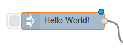

also observe that the top-right menu now has a red `Deploy` button:


This indicates the Node-RED configuration has changed and does not match the running application. Click `Deploy` to add the flow you just created into Node-RED runtime.

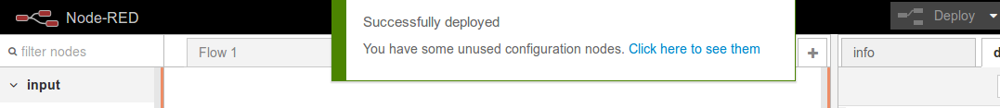

Click on the button on the left side of the `Inject` node and observe the message displayed in the debug window:

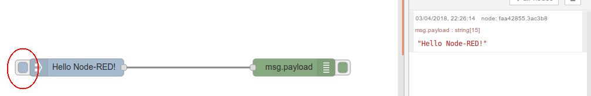

*_Congratulations!_* - you have established a working Node-RED live application, and successfully generated data.

<div style="page-break-after: always;"></div>
### Lab - enable Node-RED as a server application

Now you have a working Node-RED instance, you can add support for external applications (browsers, other applications on mobile devices, cloud apps, etc) to invoke services within Node-RED, to exchange information.

In this Lab, the goal will be to add support for incoming HTTP requests, from a browser, to request data be returned to display in the browser (i.e basic HTML).

1. Add the necessary nodes
1. Configure the nodes to support inbound HTTP and return content
1. Deploy
1. Test and validate via **_https://{{your-node-red-hostname}}_/stage1**

Using the techniques from the previous Lab, add a new flow to the canvas:
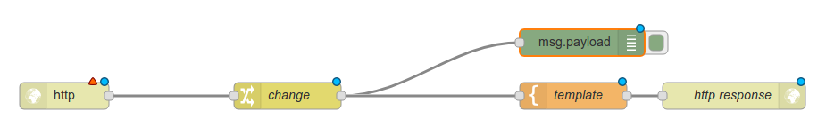.

Configure the `http` (inbound) node to accept the url _/stage1_:
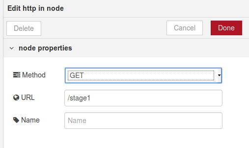

Configure the `change` node to set the response text, by chnaging `msg.payload` to the desired message.
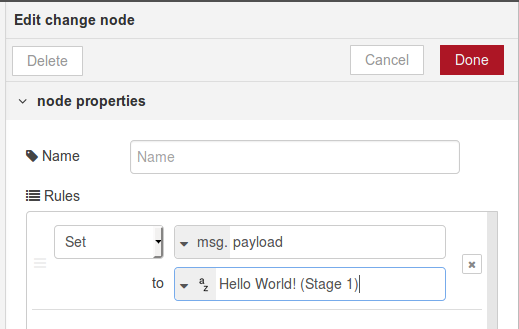

Configure the `template` node to be some simple HTML, and imbed the msg content from the flow, using [mustache templating](https://mustache.github.io/):

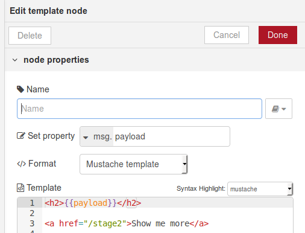.

The `http response` node does not usually need configuration, but is required as a final stage for returning data to a waiting http requester.

Now `Deploy` the changes.
To test this flow, open a new browser tab or window and load **_https://{{your-node-red-hostname}}_/stage1**.
All being well, you should receive the following response:
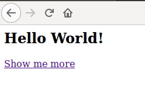

Note that if you click on the `Show me more` link, you will receive a response like `Cannot GET /stage2` - that's because "stage2" will be added in the next Lab.

*_Congratulations!_* - you have completed the first stage of establishing Node-RED as a web server application, and responding to HTTP requests with static data.

<div style="page-break-after: always;"></div>
### Lab - remote data presentation

Now your Node-RED application can service web requests, you can add support for integrating local and remote data into your responses.

In this Lab, the goal will be to take an incoming HTTP request, from a browser, retrieve data from a remote application API, and return part of the data (reformatted) to display in the browser (i.e basic HTML).

1. Add the necessary nodes
1. Configure the nodes to support inbound HTTP, invoke API, and return content
1. Deploy
1. Test and validate via **_https://{{your-node-red-hostname}}_/stage2**

The source for the remote data is a very handy, simple JSON API server provided by [@typicode](http://twitter.com/typicode)
**https://jsonplaceholder.typicode.com/** - the /users API returns a reasonable amount of data for demonstration purposes:

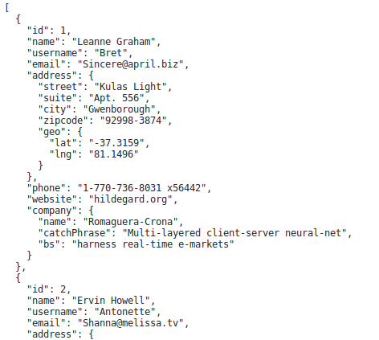

As before, add a new flow to the canvas:
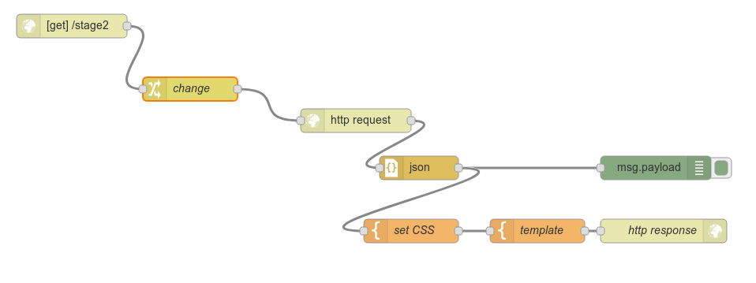

A small, but important difference to note this time - instead of setting the `msg.payload` property, the `change` node is placing the target API url into the `msg.url` property. This is used to dynamically configure the `http request` node.
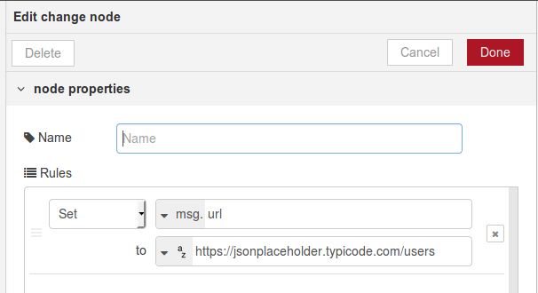

The `http request` node does not need any specific configuration for this flow.

The response from https://jsonplaceholder.typicode.com/users is a string; to process more easily and efficently in Node-RED, we pass it through a `JSON` node which will parse the string into a JSON object (in this case an array of *user* objects).

To add a little sophistication to the response content, the two `template` nodes allow generation of dynamic HTML, and support the creation of inline CSS.

The first `template` sets a msg property `msg.css` to some simple CSS for imbedding in the returned HTML:

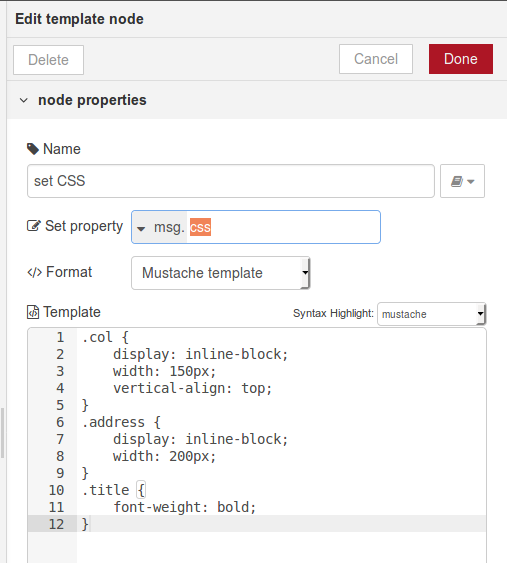
```
.col {
    display: inline-block;
    width: 150px;
    vertical-align: top;
}
.address {
    display: inline-block;
    width: 200px;
}
.title {
    font-weight: bold;
}
```

The second `template` node creates a tabular response from the users array, and imbeds the CSS:
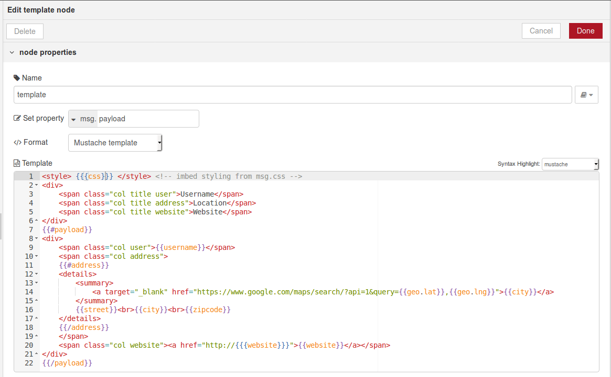
```
<style> {{{css}}} </style> <!-- imbed styling from msg.css -->
<div>
    <span class="col title user">Username</span>
    <span class="col title address">Location</span>
    <span class="col title website">Website</span>
</div>
{{#payload}}
<div>
    <span class="col user">{{username}}</span>
    <span class="col address">
    {{#address}}
    <details>
        <summary>
            <a target="_blank" href="https://www.google.com/maps/search/?api=1&query={{geo.lat}},{{geo.lng}}">{{city}}</a>
        </summary>
        {{street}}<br>{{city}}<br>{{zipcode}}
    </details>
    {{/address}}
    </span>
    <span class="col website"><a href="http://{{{website}}}">{{website}}</a></span>
</div>
{{/payload}}
```
Note that although the response will generate links to **Google Maps** locations, the data appears to point to random places.

And again, use the  button to update the runtime.

Now to test ...
**_https://{{your-node-red-hostname}}_/stage2**

You should see a response like:
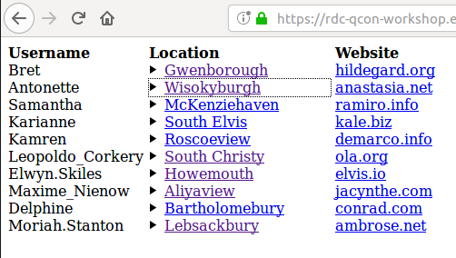

*_Congratulations!_* - you have completed the second stage of establishing Node-RED as a web server application, and responding to HTTP requests with dynamically sourced data.

The next Lab will build on your new Node-RED skills to pull in tweets from [Twitter](https://twitter.com), analyze with the Watson AI language services, and generate a dashboard showing trending emotional response.

<div style="page-break-after: always;"></div>
### Lab - twitter sentiment

This time, you can build a fun, simple application that uses the Watson Tone Analyzer service.

You will need an instance of the Watson Tone Analyzer service to created from the IBM Cloud catalog.
Switch to the IBM Cloud dashboard, select `Catalog` from the menu bar (top-right), and add " Tone" to the filter search argument.

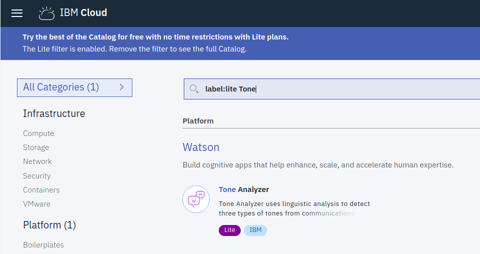

Click on `Tone Analyzer` and create a new instance, accepting all defaults.

When the instance has been provisioned, you'll be presented with the service management panel -- select the `Service credentials` option from the left navigator.
.

Then find and open the `View credentials` option:
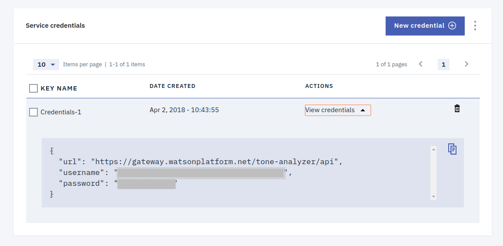

Take a note of where the `username` and `password` fields are, as you will need to copy/paste these values into the Node-RED Tone Analyzer node, shortly.

The basic application flow is based on the following Cognitive Application Reference Architecture:

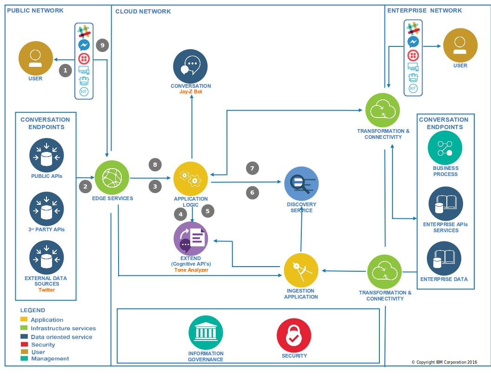


Let’s say we want to know about people’s general opinion on a specific topic on Twitter. We can use a `twitter in` node to obtain tweet feeds, then send the content to Watson Tone Analyzer service. When we get the analytic result, we will keep track of the result over time and visualize the average score of each index - similar to the following:


To produce the sample chart, you will need an additional package to be added to the Node-RED palette - `node-red-dashboard`.

From the Node-RED menu  (top-right), select `Manage palette`.

Click on the `Install` tab and enter "node-red-dashboard" in the `search modules` field.

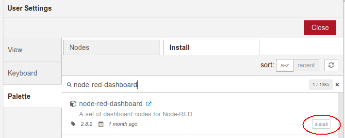

Click the `install` button.

All being well, you should see the additonal nodes being dynamically added to the list of available nodes:
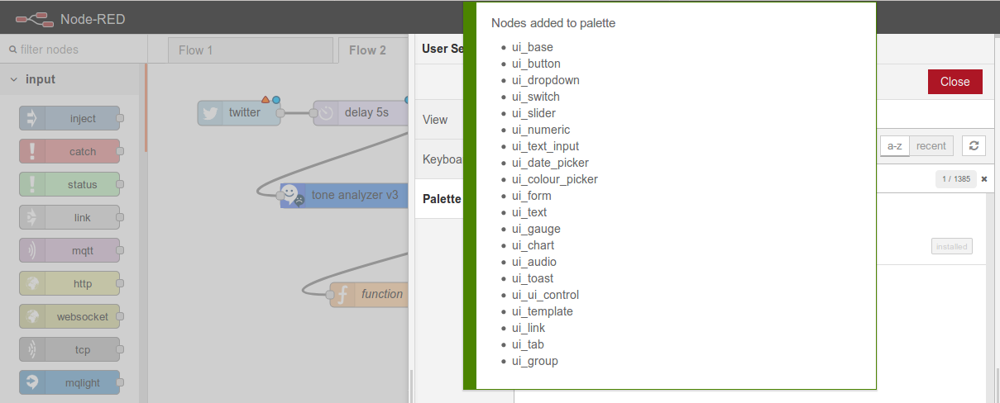

You'll find these new nodes towards the bottom of the left-side palette menu.

Once more, create a new flow on the canvas with the following nodes:
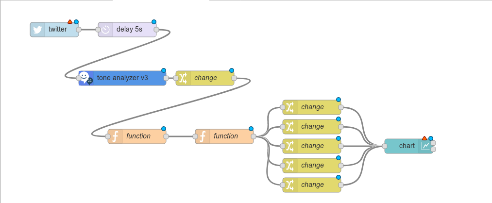

For this Lab we will use **#Trump** as the Twitter topic to monitor.

Since this topic is VERY active at the moment, we have to avoid the flood of the incoming tweets overwhelming the Node-RED instance. Add a `delay` node after the `twitter` node and setting the node action to “Limit rate to” 1 message per 1 seconds - this should leave sufficient time for the Watson Tone Analyzer service to handle each request.

You will need to fill in the service credentials (username and password) from the Watson Tone Analyzer service that you created earlier.

In this example, the purpose is to extract emotion tones, so select the `Emotion` option in the `Tones` field.

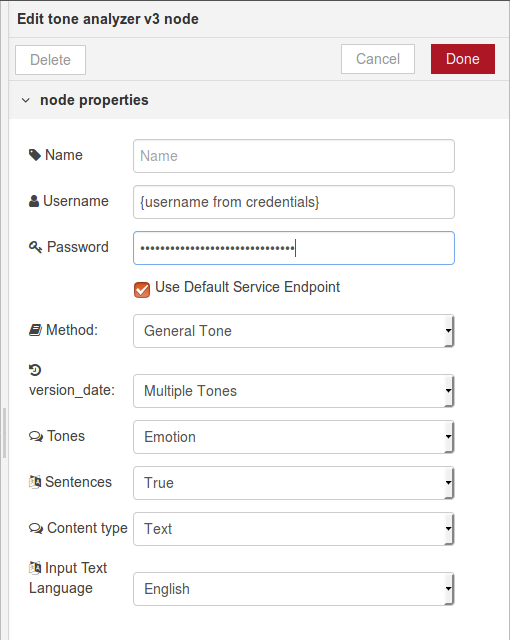

Since the result from the Watson Tone Analyzer will be in `msg.response`, we can add a `change` node to move `msg.response` to `msg.payload` to make it easier to process in subsequent nodes.

In a `function` node named “Add tweet scores to total”, the scores can be accummulated using the following code:

```
var defaultResult = {
  "emotion_tone":{
  "Anger":0,
  "Disgust":0,
  "Joy":0,
  "Sadness":0,
  "Fear":0
  },
  "count":0
}

if(msg.payload) {

  var result = context.get('twitterAnalysis')||defaultResult;

  msg.payload.document_tone.tone_categories.forEach(function(toneCategory){
    if(toneCategory.tones){
      toneCategory.tones.forEach(function(tone){
        result[toneCategory.category_id][tone.tone_name] += tone.score;
      })
    }
  })
  result.count += 1;

  context.set('twitterAnalysis', result);

  return {payload:result};
}
```

Here, we add the scores of each tone and then save into a context variable named “twitterAnalysis”. A track of the count is kept, for the next node to use in calculating avergages.

The next `function` node calculates averages with this code:

```
if(msg.payload.count){

  msg.type = "newMsg";

  for (var toneCategory in msg.payload) {
    if (!msg.payload.hasOwnProperty(toneCategory)) continue;
    var obj = msg.payload[toneCategory];
    for (var prop in obj) {
      if(!obj.hasOwnProperty(prop)) continue;
      obj[prop] = obj[prop]/msg.payload.count;
    }
  }
}

return msg;
```

In order to show the scores of each tone, each score needs to be moved into different topics before sending to the dashboard `chart` node. We use the `change` node to do this; here is an example for the "Anger" score:

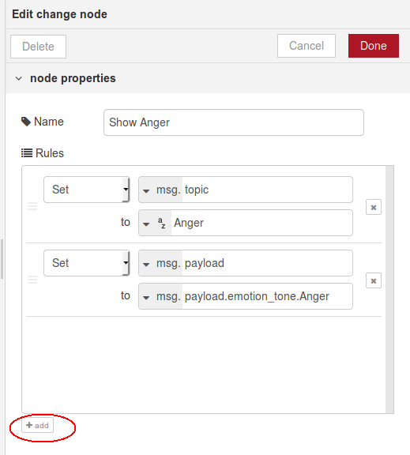

Note that the second `Set` section has been added using the `+ add` button lower-left.

Modify the other `change` nodes in a similar way to reflect "Joy", "Sadness", "Disgust" and "Fear"

The `chart` node will need some configuration to allow it to display the rolling average of the 5 different emotion categories.

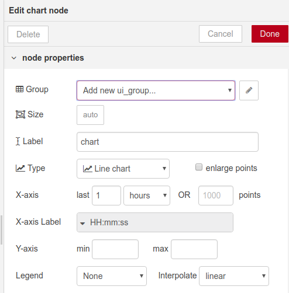

Click the edit  button to establish a default dashboard for the chart.

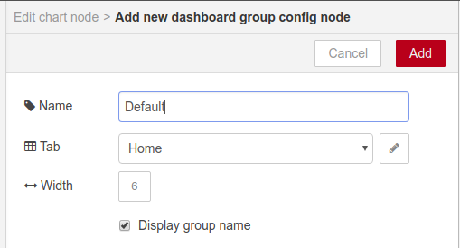

and click `Add`.

Make sure the `Legend` option is updated to `Show` so you can distinguish between the various lines.

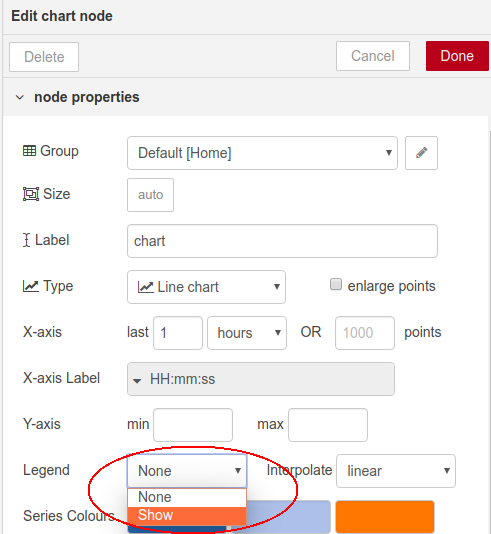

Once you redeploy the application, following the link to the Dashboard

and you should see the chart building:

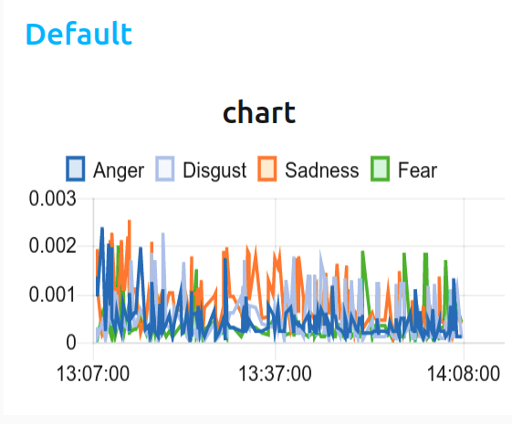

*_Congratulations!_* - you have completed the process of integrating live Twitter with Watson's natural language processing capabilities for identifying emtional tone.

The next Lab will extend this to .

<div style="page-break-after: always;"></div>
### Lab - twitter chatbot setup

Now, a selection of the tweets can be directed to a chatbot service to trigger a response (based on the Watson Assitant service).

Firstly, get hold of an existing Chatbot configuration; for this lab, we will be using one of the many Bot definitions in the [IBM Bot Asset Exchange](https://developer.ibm.com/code/exchanges/bots/?s=jay-z)

Click the `Get this bot` option and save the resulting JSON string to a local file. This file will be imported into the Watson Assistant tool shortly.

This bot responds to queries with the lyrics and wisdom of renowned artists [Jay-Z](https://en.wikipedia.org/wiki/Jay-Z).

Yo will need to create an instance of the Watson Assistant service in the IBM Cloud catalog -
 

As before, leave the name to default, create the instance, and then use the `Launch Tool` option to beging creating a Conversation workspace.


Select the `Create a Workspace` option


And *_carefully_* **NOT** clicking on the `Create` option, select the `Import workspace` icon   and navigate to your saved Jay-Z bot JSON file.


This should result in a new workspace being created, using the definitions in the JSON file


This will create the 3 main areas of chatbot server configuration:
1. Intents:

1. Entities:

1. Dialog:


Using the existing Node-RED flow, select one of the tone category streams from the twitter anlysis [Joy, Anger, Disgust, Sadness, Fear], to direct into the Chatbot, using the Watson Conversation node 

You will need the credentials for the Watson Assistant instance, to plug into the node configuration menu. Either:
+ make a connection between the Watson Assitant instance, and your Node-Red application, and after re-stage, the credentials will automatically populate the Watson Conversation nodes
+ copy the credentials from the Watson Assitant instance, and apply directly to the node configuration, and use straight away (as you did previously for the Watson Tone Analyzer service)


**Note** - you also need the Watson Assistant workspace identifiers to plug in to the node configuration

Select the `Workspaces` tab, to see access the workspaces in this instance.


Click the details menu  and select `View details` to view the `Workspace ID`  - copy this into the corresponding field in the Node-RED Conversation node configuration panel.


<div style="page-break-after: always;"></div>
## Challenge
## Congrats!
